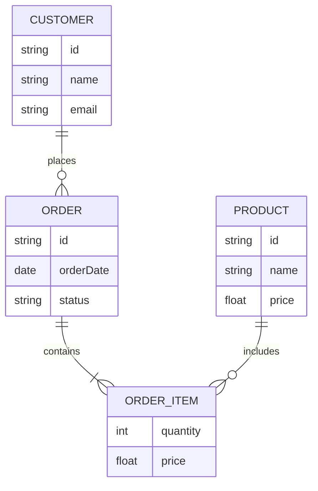

This is a post

:::tip{title="OK"}
this is a pipe
:::

```kotlin title=".kt"
if(){
 ds
}
```


```mermaid caption="Diagram"
erDiagram
    CUSTOMER ||--o{ ORDER : places
    ORDER ||--|{ ORDER_ITEM : contains
    PRODUCT ||--o{ ORDER_ITEM : includes
    CUSTOMER {
        string id
        string name
        string email
    }
    ORDER {
        string id
        date orderDate
        string status
    }
    PRODUCT {
        string id
        string name
        float price
    }
    ORDER_ITEM {
        int quantity
        float price
    }
```

:::finding{id="dsd" severity="medium" cwe="CWE-5435" title="te"}
fsds
:::
